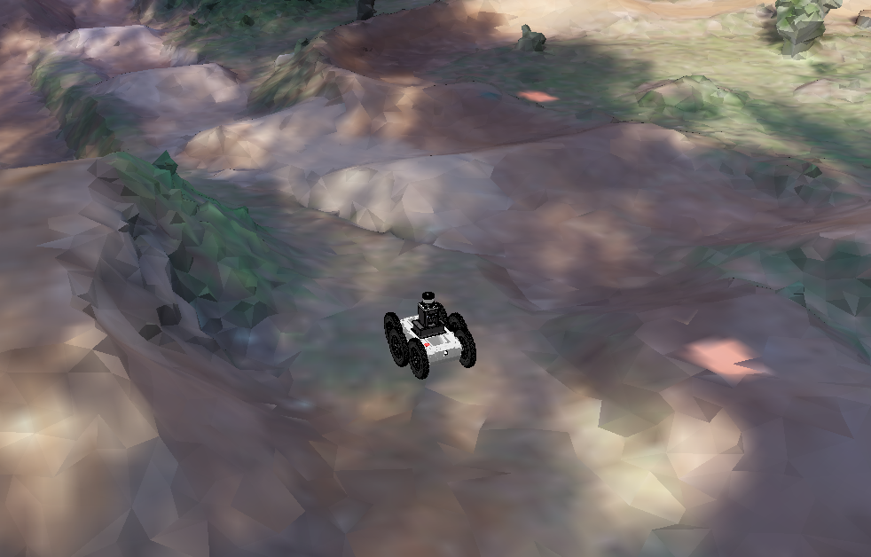
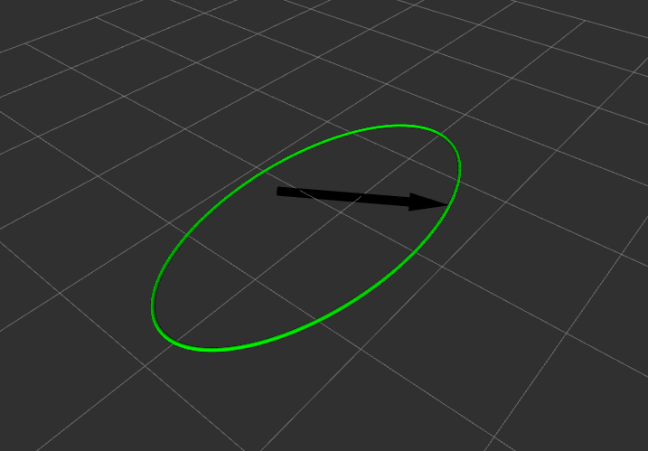
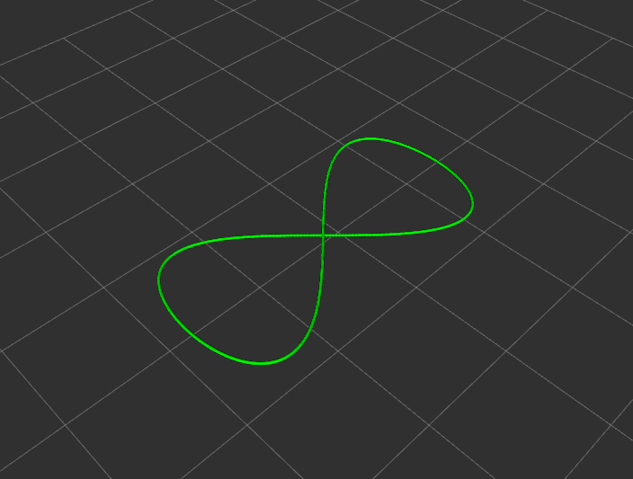
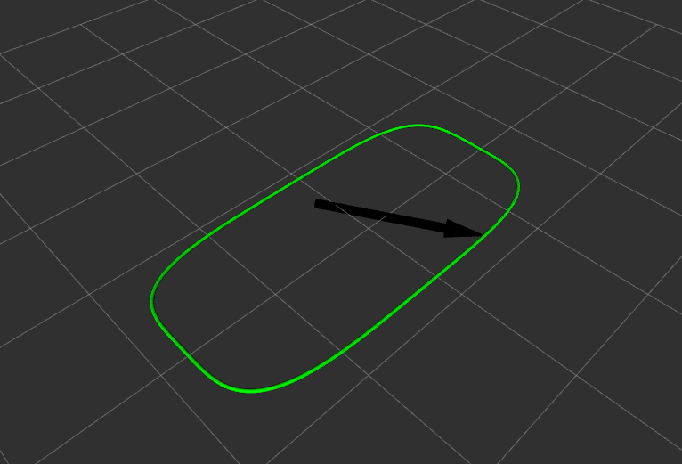
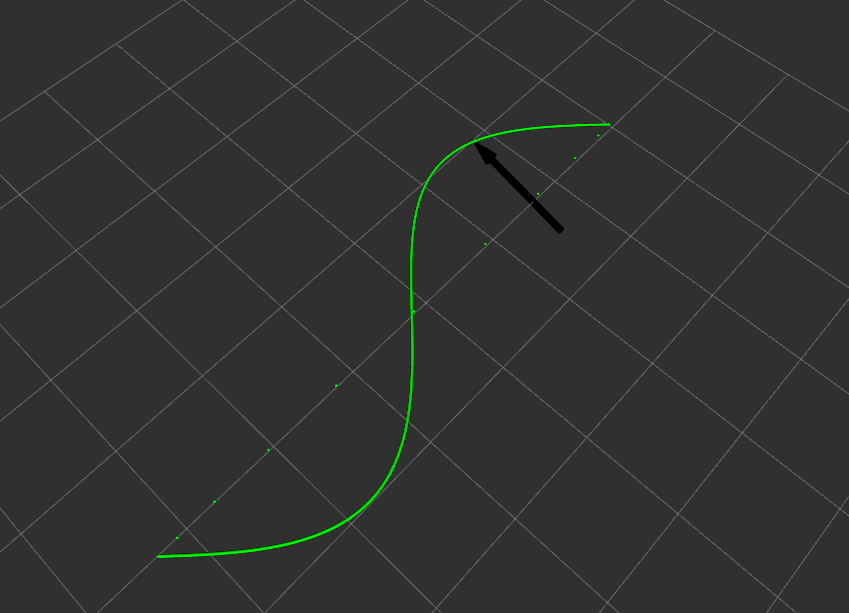

## How did we collect data for the research?

We used the CoppeliaSim simulator to simulate robots doing inspection tasks, and collecting [Odometry/Pose](http://docs.ros.org/en/noetic/api/nav_msgs/html/msg/Odometry.html) data.

All robot trajectory planning and ROS integration are available at [ITV/ROC](https://github.com/ITVRoC/espeleo_vrep_simulation) repositories.

<figure>
  
  <figcaption>An EspeleoRobô robot in an inspection scenario in the Coppelia simulator</figcaption>
</figure>

## Robot Trajectories

The robots' trajectories for the data collected are the following:

(add images and descriptions) 

- Robot 1:

<figure>
  
  <figcaption>An elipse trajectory</figcaption>
</figure>

- Robot 2:

<figure>
  
  <figcaption>A '8 like' trajectory</figcaption>
</figure>

- Robot 3:

<figure>
  
  <figcaption>A 'rectangular' trajectory</figcaption>
</figure>

- Robot 4:

<figure>
  
  <figcaption>A sinusoidal trajectory</figcaption>
</figure>